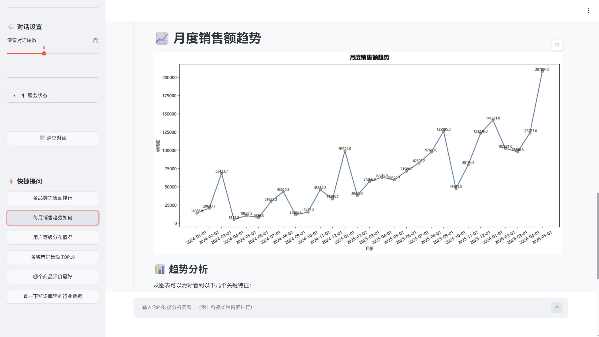
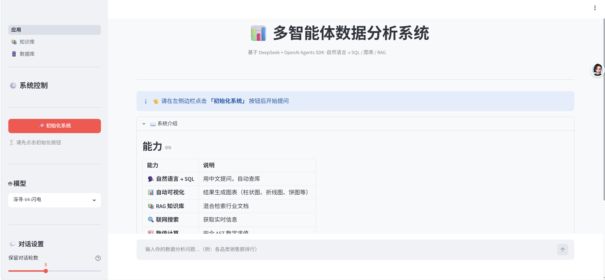

# 多智能体数据分析系统

<p align="center">
  <b>用自然语言问数据 · 让 AI 帮你分析</b>
  <br>
  <i>OpenAI Agents SDK · DeepSeek · 多智能体编排 · 自动可视化 · RAG 知识库</i>
</p>

<p align="center">
  
  
  
  
  
  
</p>

<p align="center">
  
</p>

---

## 痛点 & 解决方案

| 痛点 | 解决方案 |
|------|---------|
| 分析数据要写 SQL，业务人员不会 | 中文提问，AI 自动理解意图并生成查询 |
| 查完数据还要复制到 Excel 画图 | 一句话同时完成查询、计算、图表生成 |
| 行业报告分散在 PDF/文档里，没法联动查询 | RAG 知识库自动索引，直接提问即可检索 |
| 多个分析步骤要手动衔接（查 A → 算 B → 画 C） | 多智能体自动编排，handoff 机制串联任务 |

**一句话：输入中文问题，系统自动查数据库、算指标、画图表、搜知识库，一步到位。**

---

## 快速开始

```bash
# 1. 安装依赖
python -m venv venv
.\venv\Scripts\activate      # Windows
pip install -r requirements.txt

# 2. 配置 API Key
cp .env.example .env
# 编辑 .env，填入 DEEPSEEK_API_KEY

# 3. 一键启动
python run.py
```

浏览器打开 `http://localhost:8501`，点击 **「初始化系统」**，开始提问。

---

## 使用方式

### Web 界面（推荐）

```bash
python run.py
```

<p align="center">
  
</p>

### CLI 交互模式

```bash
python run.py --cli
```

<p align="center">
  
</p>

### 典型问题

```
各品类销售额排行
每月销售趋势如何
用户等级分布情况
各城市销售额 TOP10
对比 Q1 和 Q2 的销售数据，算增长率，画图
```

---

## 系统架构

四智能体 + 四服务，各司其职：

```
用户提问
    │
    ▼
┌─────────────────────────────────────────────────┐
│              主智能体（调度中枢）                  │
│  理解意图 → 分发任务 → 整合结果 → 最终回复        │
└──────┬──────────┬──────────┬────────────────────┘
       │ handoff  │ handoff  │ handoff
       ▼          ▼          ▼
┌──────────┐ ┌──────────┐ ┌──────────┐
│ DB 智能体 │ │VIZ 智能体│ │RAG 智能体│
│ 数据库查询 │ │ 图表生成  │ │ 知识库检索│
└─────┬────┘ └────┬─────┘ └─────┬────┘
      │ MCP       │ MCP         │ MCP
      ▼           ▼             ▼
┌──────────┐ ┌──────────┐ ┌──────────┐ ┌──────────┐
│ DB       │ │Analysis  │ │ RAG      │ │Calculator│
│ :8000    │ │ :8001    │ │ :8002    │ │ :8003    │
│ DuckDB   │ │pyecharts │ │ChromaDB  │ │AST 安全  │
│          │ │matplotlib│ │+ BM25    │ │表达式求值│
└──────────┘ └──────────┘ └──────────┘ └──────────┘
```

**数据流：**

```
查数据    → 主智能体 → handoff DB 智能体 → SQL 查询 → 返回表格
画图表    → 主智能体 → handoff VIZ 智能体 → 分析数据 → 生成 PNG
搜知识库  → 主智能体 → handoff RAG 智能体 → 混合检索 → 返回原文
算数字    → 主智能体 → calculate 工具 → AST 求值 → 返回结果
```

---

## 智能体

| 智能体 | 能力 | 调用方式 |
|--------|------|---------|
| **主智能体** | 理解意图、分发任务、整合回复 | 用户直接对话 |
| **DB 智能体** | 查 Schema、写 SQL、返回数据 | 主智能体 handoff |
| **VIZ 智能体** | 数据分析、生成图表（柱状/折线/饼图等） | 主智能体 handoff |
| **RAG 智能体** | 知识库检索、联网搜索 | 主智能体 handoff |

子智能体完成任务后自动 `return_to_main` 交回控制权。

---

## MCP 服务

### 数据库查询服务（:8000）
DuckDB 嵌入式数据库，只读 SQL 查询。

| 工具 | 用途 |
|------|------|
| `query_sql` | 执行 SELECT 查询（DDL/DML 自动拦截） |
| `get_tables` / `get_schema` | 查看表结构和元数据 |

### 数据分析可视化服务（:8001）
pyecharts + matplotlib，支持 10+ 图表类型。

| 工具 | 用途 |
|------|------|
| `describe_data` | 数据质量分析、统计摘要 |
| `draw_chart` / `visualize_data` | 自动选型并生成图表 |

### 知识库 RAG 检索服务（:8002）
ChromaDB 向量检索 + BM25 关键词 + RRF 融合排序。

| 工具 | 用途 |
|------|------|
| `search_knowledge` | 混合检索（语义 + 关键词） |
| `upload_document` | 上传 PDF/DOCX/XLSX/TXT/MD/CSV |
| `web_search` | 联网搜索（Tavily） |

### 计算器服务（:8003）
AST 白名单安全求值，杜绝 `eval` 注入。

---

## 数据库

内置 DuckDB 电商数据库 `ecommerce.db`，6 张表约 4MB：

| 表 | 说明 |
|----|------|
| `orders` | 订单：金额、时间、城市、支付方式 |
| `users` | 用户：等级、注册日期 |
| `products` | 商品：名称、价格、品类 |
| `categories` | 品类：名称 |
| `reviews` | 评价：评分、内容 |
| `inventory` | 库存：数量、变动日期 |

---

## 技术栈

| 层面 | 选型 | 原因 |
|------|------|------|
| **LLM** | DeepSeek V4 | 高性价比中文推理 |
| **智能体框架** | OpenAI Agents SDK | 原生 handoff 编排、MCP 集成 |
| **通信协议** | MCP Streamable HTTP | 按需请求，无需长连接 |
| **数据库** | DuckDB | 嵌入式列式存储，免安装 |
| **可视化** | pyecharts + matplotlib | 交互式 + 静态双引擎 |
| **向量检索** | ChromaDB + sentence-transformers | 本地持久化，免云服务 |
| **关键词检索** | jieba + rank-bm25 | 中文分词 BM25 |
| **融合排序** | RRF（K=60） | 无参数调优的混合排序 |
| **文档解析** | pdfplumber / python-docx / openpyxl | 多格式支持 |
| **前端** | Streamlit | 快速搭建数据应用 |

---

## Docker 部署

```bash
cp .env.example .env
docker compose up -d
# 访问 http://localhost:8501
```

数据持久化：向量索引、知识库文档、生成的图表均通过 volume 保存，重启不丢失。

---

## 命令速查

| 命令 | 作用 |
|------|------|
| `python run.py` | 启动服务 + Web 界面 |
| `python run.py --cli` | 启动服务 + CLI 模式 |
| `python run.py --server` | 仅启动 MCP 服务 |
| `python run.py --stop` | 停止所有服务 |

---

## 项目结构

```
├── agent_system/          # 智能体编排（11 模块）
├── app/                   # Streamlit 前端（6 模块）
├── mcp_servers/           # MCP 服务器集群
│   ├── common/            #   公共组件（日志、限流）
│   ├── db_server/         #   数据库查询服务
│   ├── analysis_server/   #   数据分析可视化服务
│   ├── rag_server/        #   知识库 RAG 检索服务
│   └── calculator_server/ #   安全计算器服务
├── pages/                 # 知识库 & 数据库管理页面
├── knowledge_base/        # 知识库文档
├── assets/                # 项目截图
├── tests/                 # 测试用例
│
├── run.py                 # 统一启动脚本
├── ecommerce.db           # 电商数据
├── requirements.txt
├── Dockerfile / docker-compose.yml
└── .env.example
```

---

## 前置条件

- **Python 3.11+**
- **DeepSeek API Key** — [申请](https://platform.deepseek.com/api_keys)
- **（可选）Tavily API Key** — 联网搜索，[注册](https://tavily.com)

---

<p align="center">
  <sub>MIT License · 基于 OpenAI Agents SDK + DeepSeek 构建</sub>
</p>
