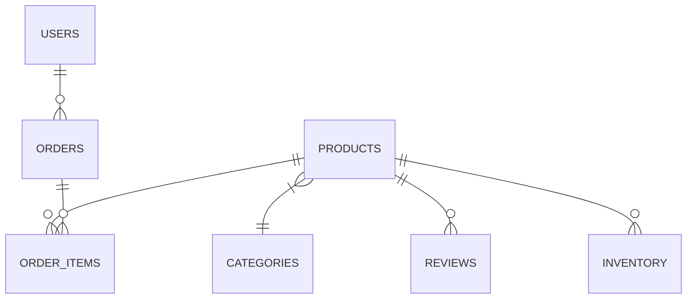

# 多智能体数据分析系统 — 设计文档

> 版本 1.0 · 2026-06-25

---

## 目录

1. [概述](#1-概述)
2. [系统架构](#2-系统架构)
3. [智能体层设计](#3-智能体层设计)
4. [MCP 服务层设计](#4-mcp-服务层设计)
5. [前端层设计](#5-前端层设计)
6. [数据模型](#6-数据模型)
7. [通信协议](#7-通信协议)
8. [部署设计](#8-部署设计)
9. [技术选型与决策记录](#9-技术选型与决策记录)
10. [安全设计](#10-安全设计)
11. [演进方向](#11-演进方向)

---

## 1. 概述

### 1.1 项目定位

多智能体数据分析系统是一个基于自然语言交互的数据分析平台。用户输入中文问题，系统自动编排多个 AI 智能体协作完成数据库查询、指标计算、图表生成和知识库检索，无需编写 SQL 或手动操作分析工具。

### 1.2 核心目标

- **零门槛分析**：业务人员用自然语言提问即可获取数据洞察
- **全链路自动化**：从查数据 → 算指标 → 画图表 → 搜知识库，一步到位
- **可扩展服务架构**：按需增减 MCP 服务，智能体自动感知新工具
- **高容错性**：智能体误判、服务崩溃等异常场景自动修复或引导

### 1.3 设计原则

| 原则 | 说明 |
|------|------|
| **智能体优先** | 逻辑编排由智能体自主决策，代码不做硬编码流程 |
| **单任务 handoff** | 每次子智能体调用只做一件事，多任务场景循环 handoff |
| **会话隔离** | 前端独立的 asyncio 事件循环，不阻塞 Streamlit 主线程 |
| **安全求值** | 所有数值计算走 AST 白名单，杜绝 `eval` 注入 |
| **离线可用** | 核心功能不依赖外部云服务，向量模型可本地部署 |

---

## 2. 系统架构

### 2.1 分层架构

```
┌─────────────────────────────────────────────────────────┐
│                    表现层 (Presentation)                   │
│       Streamlit Web (app/)  ·  CLI (agent_system/cli.py)  │
├─────────────────────────────────────────────────────────┤
│                    编排层 (Orchestration)                  │
│            agent_system/  ·  OpenAI Agents SDK             │
│     4 个 Agent · handoff 路由 · 工具映射 · MCP 连接管理    │
├─────────────────────────────────────────────────────────┤
│                    服务层 (Services)                       │
│   db_server  │  analysis_server  │  rag_server  │ calc   │
│   :8000      │  :8001            │  :8002       │ :8003  │
├─────────────────────────────────────────────────────────┤
│                   基础设施层 (Infrastructure)               │
│  DuckDB  │ ChromaDB  │ pyecharts/matplotlib  │ DeepSeek   │
└─────────────────────────────────────────────────────────┘
```

### 2.2 全局架构图

```
┌─────────────────────────────────────────────────────────┐
│  run.py  (统一启动器)                                     │
│  ├── 启动 4 个 MCP Server 子进程                           │
│  └── 启动 CLI 或 Streamlit Web                           │
└────────────┬────────────────────────────────────────────┘
             │
     ┌───────┴──────────────┐
     │                      │
     ▼                      ▼
┌──────────────┐    ┌──────────────────┐
│ CLI 模式      │    │ Streamlit Web     │
│ agent_system/ │    │ app/              │
│ cli.py        │    │ ui.py + render.py │
│ 调用 ─────────┼───▶│ async_runner.py   │
└──────┬───────┘    │ (独立线程跑asyncio)│
       │            └────────┬─────────┘
       │                     │
       └──────────┬──────────┘
                  ▼
┌─────────────────────────────────────────┐
│  agent_system/ (智能体编排核心)           │
│                                         │
│  agents.py         4 个 Agent 实例       │
│  conversation.py   run_agent 系列        │
│  tool_routing.py   monkey-patch 路由     │
│  deepseek_patch.py DeepSeek 兼容补丁     │
│  mcp_connection.py MCP 连接生命周期管理   │
│  handoff_filters.py 上下文清洗            │
│  mappings.py       工具-智能体映射表      │
└────────────┬────────────────────────────┘
             │ MCP Streamable HTTP
             ▼
┌─────────────────────────────────────────┐
│  MCP 服务器集群                           │
│  ┌──────┐ ┌──────┐ ┌──────┐ ┌─────────┐│
│  │ :8000 │ │ :8001 │ │ :8002 │ │ :8003  ││
│  │ DB    │ │ VIZ   │ │ RAG   │ │ Calc   ││
│  │DuckDB │ │pyechts│ │Chroma │ │ AST    ││
│  │SQL    │ │mpl    │ │BM25   │ │安全求值││
│  └──────┘ └──────┘ └──────┘ └─────────┘│
│  common/ (日志 · 限流器)                 │
└─────────────────────────────────────────┘
```

### 2.3 服务拓扑

| 组件 | 技术栈 | 端口 | 进程模型 |
|------|--------|------|---------|
| Streamlit Web | Streamlit + Python | 8501 | 主进程 |
| DB Server | FastMCP + DuckDB | 8000 | 子进程 |
| VIZ Server | FastMCP + pyecharts/matplotlib | 8001 | 子进程 |
| RAG Server | FastMCP + ChromaDB + sentence-transformers | 8002 | 子进程 |
| Calculator Server | FastMCP + AST Evaluator | 8003 | 子进程 |

---

## 3. 智能体层设计

### 3.1 智能体定义

系统定义 4 个智能体，均通过 OpenAI Agents SDK 的 `Agent` 类实例化（定义在 [agent_system/agents.py](../agent_system/agents.py)）：

| 智能体 | 角色 | 挂载的工具/服务 | handoff 权限 |
|--------|------|----------------|-------------|
| `main_agent` | 调度中枢 | calculate (:8003) | → DB / VIZ / RAG |
| `db_agent` | 数据库分析师 | db_server (:8000) + calculate (:8003) | → main_agent（仅返回） |
| `viz_agent` | 数据可视化师 | analysis_server (:8001) + calculate (:8003) | → main_agent（仅返回） |
| `rag_agent` | 知识库研究员 | rag_server (:8002) + calculate (:8003) | → main_agent（仅返回） |

### 3.2 编排拓扑

采用**星型拓扑**设计：

```
用户提问
    │
    ▼
┌──────────────────────────────────────────┐
│            主智能体 (main_agent)           │
│  意图理解 → 任务拆分 → handoff → 整合输出  │
└──────┬──────────┬──────────┬────────────┘
       │ handoff  │ handoff  │ handoff
       ▼          ▼          ▼
┌──────────┐ ┌──────────┐ ┌──────────┐
│ DB 智能体  │ │ VIZ 智能体│ │ RAG 智能体│
│ 写SQL查询  │ │ 生成图表  │ │ 检索知识库│
└─────┬────┘ └────┬─────┘ └─────┬────┘
      │           │             │
      ▼           ▼             ▼
  db_server  analysis_server  rag_server
  (:8000)      (:8001)        (:8002)
```

**规则**：
- 子智能体之间不能直接通信，必须经主智能体中转
- 每个 handoff 只执行一个子任务，多图表场景通过多次 handoff 完成
- 子智能体通过 `return_to_main` 工具交回控制权

### 3.3 Handoff 数据流

```
主智能体 → handoff → 子智能体
                        │
                        ① 接收主智能体 handoff 消息（含上下文数据）
                        ② 调用 MCP 工具执行任务
                        ③ 调用 return_to_main(结果摘要)
                        │
主智能体 ← handoff ←───┘
                        ④ 接收子智能体返回的结果
                        ⑤ 整合到最终回复
```

**注意**：`handoff_filters.py` 中的 `strip_tool_filter` 会在 handoff 时清除跨智能体传递的 tool_call 历史（OpenAI Agents SDK 的行为），因此主智能体必须在 handoff 消息的文本中**显式携带上下文数据**。

### 3.4 关键 Monkey-Patch

#### 3.4.1 DeepSeek 兼容补丁 ([agent_system/deepseek_patch.py](../agent_system/deepseek_patch.py))

OpenAI Agents SDK 默认面向 OpenAI API 设计，DeepSeek API 存在差异，需做适配：

| 差异点 | SDK 默认行为 | 补丁方案 |
|--------|-------------|---------|
| 孤立 `tool_calls` 消息 | 保留在历史中传递给 API | `_sanitize_chat_messages` 清理，避免 DeepSeek 400 错误 |
| `reasoning_content` 字段 | 无该字段传输 | 补丁自动附加 `reasoning_content: null` |
| 输出格式要求 | 无额外要求 | 在主智能体 instructions 末尾追加格式约束 |

补丁通过 `Converter.items_to_messages` 的包装器实现，在消息序列化后、API 发送前执行清理。

#### 3.4.2 工具路由补丁 ([agent_system/tool_routing.py](../agent_system/tool_routing.py))

当模型在错误的上下文中选择了不属于当前智能体的工具时，SDK 会抛出 `ModelBehaviorError`。补丁将其捕获并转为内联提示，引导模型自行修正路由：

```
触发条件：子智能体误调了主智能体的工具（或反之）
处理流程：
  catch ModelBehaviorError
        ↓
  查找 _TOOL_OWNER 映射，确定正确归属
        ↓
  构造 ProcessedResponse，包含引导提示
        ↓
  模型根据提示修正行为（调用正确工具或 handoff）
```

**映射表**（定义在 [agent_system/mappings.py](../agent_system/mappings.py)）：

| 工具名 | 归属智能体 | 备选 handoff |
|--------|-----------|-------------|
| `query_sql` / `get_schema` | db_agent | → handoff query_database_agent |
| `draw_chart` / `visualize_data` | viz_agent | → handoff visualize_analysis_agent |
| `search_knowledge` / `web_search` | rag_agent | → handoff search_knowledge_agent |
| `calculate` | main_agent | 直接调用（全员挂载） |

### 3.5 MCP 连接管理 ([agent_system/mcp_connection.py](../agent_system/mcp_connection.py))

针对 OpenAI Agents SDK 的两个已知问题做了额外管理：

| 问题 | 表现 | 解决方案 |
|------|------|---------|
| Session 泄漏 | `MCPManager.cleanup()` 关闭 session 但不置 None，下次复用已关闭 session | `_clear_sessions()` 在每次 `run_agent` 后强制清空 session 引用 |
| Lock 跨事件循环 | 模块导入时创建的 `asyncio.Lock` 在 Streamlit 热重载时绑定到旧循环 | `_reset_server_locks()` 每次连接前用当前事件循环重建锁 |

连接生命周期：

```
ensure_mcp_connected(server)
  │
  ├── _reset_server_locks()       // 重建锁，避免跨事件循环
  │
  ├── MCPManager.connect()        // 建立 MCP Streamable HTTP session
  │
  └── ▶ run_agent()               // 使用 session
        │
        └── _clear_sessions()      // 清理 session 引用
```

### 3.6 会话历史管理 ([agent_system/history.py](../agent_system/history.py))

| 功能 | 实现 | 触发条件 |
|------|------|---------|
| 历史裁剪 | `_trim_history()` - 保留最近 N 轮对话 | 初始化时 `history_len` 参数（默认 20 轮） |
| 消息清洗 | `_sanitize_messages()` - 移除孤立 tool_calls | 每次构建消息历史时 |
| handoff 上下文 | explicit handoff 消息文本传递 | 每次 handoff 时 |

---

## 4. MCP 服务层设计

所有 MCP 服务基于 FastMCP 框架实现，采用 Streamable HTTP 传输模式，通过 uvicorn 提供 ASGI 服务。

### 4.1 数据库查询服务 ([mcp_servers/db_server/](../mcp_servers/db_server/))

**端口**：8000

**核心工具**：

| 工具 | 输入 | 输出 | 说明 |
|------|------|------|------|
| `query_sql` | `sql: str` | Markdown 表格 | 只读 SQL 执行，经 `validate_readonly_sql` 拦截 DDL/DML |
| `get_tables` | 无 | Markdown 列表 | 列出所有表及中文说明 |
| `get_schema` | `table: str` | Markdown 字段表 | 字段名、类型、是否可空、示例值 |
| `get_schema_markdown` | 无 | 完整数据字典 | 含表间关联关系 |
| `get_sample_data` | `table: str, n: int` | Markdown 表格 | 默认 5 条示例 |
| `get_table_stats` | `table: str` | Markdown 统计 | 行数、distinct 值、空值数 |

**架构**：

```
FastMCP 实例
    │
    ├── tools.py (工具函数，调用 data_utils.py)
    │       │
    │       └── duckdb.connect()  (全局只读连接，file:// 模式)
    │
    └── sql_validator.py
            │
            └── validate_readonly_sql()
                ├── 语法检查 (sqlparse)
                └── 语句类型白名单 (仅允许 SELECT / WITH / EXPLAIN)
```

### 4.2 数据分析可视化服务 ([mcp_servers/analysis_server/](../mcp_servers/analysis_server/))

**端口**：8001

**核心工具**：

| 工具 | 功能 | 输出 |
|------|------|------|
| `describe_data` | 数据诊断分析 | Markdown 报告（质量检查 + 统计摘要 + 图表建议） |
| `visualize_data` | 高级交互式可视化 | PNG 路径 + Markdown 描述 |
| `draw_chart` | 基础统计图表 | PNG 路径 + Markdown 描述 |
| `get_chart_types` | 列出支持的图表类型 | Markdown 列表 |

**双引擎设计**：

| 引擎 | 工具 | 优势 | 适用场景 |
|------|------|------|---------|
| **pyecharts** | `visualize_data` | 交互式（缩放、悬停、图例切换） | 多系列、分组、动态数据 |
| **matplotlib** | `draw_chart` | 静态高质量输出、降级保障 | 单图表、分组溢出场景 |

**自动推断流程**（`tools.py` → `data_utils.py`）：

```
visualize_data(data_json)
    │
    ├── auto_xy(data)            // 自动识别 X/Y 轴列
    ├── auto_chart_type(x, y, data)  // 自动选型（bar/line/pie/…）
    ├── auto_detect_group(data)  // 自动检测分组列
    │
    └── pyecharts_plots (首选) 或 mpl_plots (降级)
```

### 4.3 知识库 RAG 检索服务 ([mcp_servers/rag_server/](../mcp_servers/rag_server/))

**端口**：8002

**核心工具**：

| 工具 | 功能 | 说明 |
|------|------|------|
| `search_knowledge` | 混合检索 | BM25 + 向量 + RRF 重排序 |
| `web_search` | 联网搜索 | 基于 Tavily API |
| `upload_document` | 文档上传建索引 | 支持 PDF/DOCX/XLSX/TXT/MD/CSV |
| `list_documents` | 列出已索引文档 | 元数据概览 |
| `delete_document` | 删除文档及分块 | 级联清理 |
| `reindex_all` | 全量重建索引 | 建议每周或新增嵌入模型后执行 |

**混合检索架构**：

```
search_knowledge(query, top_k)
    │
    ├── BM25 检索 (bm25_store.py)
    │   └── jieba 分词 + rank_bm25 打分
    │
    ├── 向量检索 (chroma_store.py)
    │   └── sentence-transformers 嵌入 + ChromaDB 相似度
    │
    └── RRF 融合 (hybrid_search.py)
        └── 公式: score(d) = Σ(1 / (k + rank(d)))   (k=60)
            └── 返回 top_k 融合结果
```

**文档处理流程**：

```
upload_document(file_path)
    │
    ├── 文件类型识别 (doc_manager.py)
    │   ├── QA 型（如 ecommerce_qa.md）→ 不分块，直接入库
    │   └── 文档型（其他）→ 分块 (chunk_size=512, overlap=128)
    │
    ├── 文档解析 (document_parser.py)
    │   └── pdfplumber / python-docx / openpyxl / txt / md / csv
    │
    ├── 双索引写入
    │   ├── BM25 索引 (bm25_store.py)
    │   └── 向量索引 (chroma_store.py + ChromaDB)
    │
    └── 可选同步 Supabase (config.py → SUPABASE_*)
```

### 4.4 计算器服务 ([mcp_servers/calculator_server/](../mcp_servers/calculator_server/))

**端口**：8003

**核心工具**：

| 工具 | 输入 | 输出 | 说明 |
|------|------|------|------|
| `calculate` | `expression: str` | 计算结果 | AST 白名单安全求值 |

**安全求值设计**（[evaluator.py](../mcp_servers/calculator_server/evaluator.py)）：

```
calculate("avg([10, 20, 30])")
    │
    ├── ast.parse(expression)           // 解析为 AST
    │
    ├── _SafeEvaluator.visit()          // AST 节点白名单校验
    │   ├── ✅ 允许：BinOp, UnaryOp, Num, List, Call(白名单函数)
    │   ├── ❌ 拒绝：exec/eval/__import__/open/…
    │   └── ❌ 拒绝：属性访问、赋值、import
    │
    └── 白名单函数列表
        ├── 数学：abs, round, min, max, sum, len, pow
        ├── 三角：sin, cos, tan, asin, acos, atan
        ├── 统计：avg, median, std_dev, variance
        ├── 常量：pi, e, tau, inf, nan
        └── 高阶：map, filter, sorted, enumerate, zip
```

### 4.5 公共组件 ([mcp_servers/common/](../mcp_servers/common/))

#### Rate Limiter ([rate_limiter.py](../mcp_servers/common/rate_limiter.py))

三层限流设计：

```
RateLimiter(max_concurrent=5, max_rate=30, window=60)
    │
    ├── 并发控制 (asyncio.Semaphore)
    │   └── max_concurrent: 同时处理的最大请求数
    │
    ├── 频率控制 (滑动窗口)
    │   └── max_rate/window: 窗口内最大请求数
    │
    └── 队列溢出保护
        └── 超过排队上限 → 返回友好提示，不抛异常
```

**惰性初始化**：`asyncio.Semaphore` 等原语在首次使用时才创建（`_ensure()` 方法），避免跨事件循环重建时失效。

#### 日志配置 ([logging_config.py](../mcp_servers/common/logging_config.py))

- 控制台输出 + 文件轮转（`logs/` 目录）
- 按天滚动，保留 30 天
- 统一格式：`[时间] [级别] [模块] 消息`

---

## 5. 前端层设计

### 5.1 Streamlit Web 前端 ([app/](../app/))

#### 5.1.1 模块结构

| 模块 | 职责 |
|------|------|
| `config.py` | Streamlit 页面配置（图标、布局、CSS）、Session State 初始化 |
| `ui.py` | 侧边栏渲染（初始化、模型选择、历史轮数、服务状态、快捷提问）和聊天界面主布局 |
| `render.py` | 系统初始化、模型切换、MCP 连通性检查、回复内容渲染（含图表） |
| `async_runner.py` | 在独立线程中运行 asyncio 智能体，通过 TracingProcessor 捕获进度事件 |
| `progress.py` | 线程安全的进度缓冲区、智能体事件到用户消息的映射 |
| `utils.py` | MCP 工具同步调用辅助、异步执行器 |

#### 5.1.2 双线程模型

```
┌─────────────────┐      ┌──────────────────────────┐
│  Streamlit       │      │  ThreadPoolExecutor(1)    │
│  主线程           │      │                           │
│                  │      │  asyncio.run(run_agent())  │
│  ui.py 渲染      │      │    │                       │
│  render.py 更新  │      │    ├── 调用 MCP 工具        │
│  _ProgressBuffer ◀──────│    ├── handoff 智能体       │
│  轮询(0.5s)      │      │    └── 返回最终结果          │
│                  │      │                           │
│  future.result() ◀──────│    result                  │
│  (timeout=0.5s)  │      │                           │
└─────────────────┘      └──────────────────────────┘
```

**设计原因**：Streamlit 自身维护了一个 WebSocket 事件循环用于热重载和状态同步，与 asyncio 事件循环冲突。通过 `ThreadPoolExecutor(max_workers=1)` 在独立线程中运行 asyncio 事件循环，避免冲突。

**进度反馈**：`_StreamlitTracingProcessor` 实现 OpenAI Agents SDK 的 `TracingProcessor` 接口，捕获 `HandoffSpanData` 和 `FunctionSpanData`，转为带 emoji 的用户友好消息实时展示。

| 事件类型 | 显示 |
|---------|------|
| 开始 handoff | `🔄 正在调用 {智能体名称}...` |
| 工具调用开始 | `🔧 正在使用 {工具名}...` |
| handoff 返回 | `✅ {智能体名称} 完成任务` |
| 工具调用结束 | `✅ {工具名} 执行完成` |

#### 5.1.3 图表渲染

`render_response()` 支持两种图表引用格式：

1. **标准 Markdown 图片**：``
2. **裸路径**：检测到纯 `.png` 路径文本时自动转为图片显示

图表路径检测逻辑：逐行扫描回复文本，查找 `reports/charts/` 目录下的 `.png` 文件引用。

### 5.2 CLI 前端 ([agent_system/cli.py](../agent_system/cli.py))

| 模式 | 行为 |
|------|------|
| 交互模式（默认） | 连续问答循环，`exit` 退出 |
| 单次查询 (`--query "..."`) | 执行一次查询后退出 |

CLI 模式通过 `_ProgressProcessor` 在控制台实时打印进度（带颜色标记）。

---

## 6. 数据模型

### 6.1 电商数据库 (DuckDB)

内置 `ecommerce.db`，约 4MB，6 张表：



| 表 | 字段 | 行数(约) | 说明 |
|----|------|----------|------|
| `orders` | id, user_id, total_amount, city, payment_method, order_date, status | 5000+ | 订单主表 |
| `users` | id, name, level, register_date | 1000+ | 用户信息 |
| `products` | id, name, price, category_id | 500+ | 商品信息 |
| `categories` | id, name | 10+ | 品类字典 |
| `reviews` | id, product_id, rating, content, review_date | 3000+ | 商品评价 |
| `inventory` | id, product_id, quantity, change_date | 5000+ | 库存变动记录 |

### 6.2 RAG 知识库

| 存储 | 内容 | 持久化路径 |
|------|------|-----------|
| ChromaDB 向量索引 | 文档分块的嵌入向量 | `chroma_db/` |
| BM25 序列化索引 | 分词后的 BM25 结构 | `bm25_index.pkl` |
| Supabase (可选) | 文档元数据和文本块的远端备份 | 远端 PostgreSQL |
| `knowledge_base/raw/` | 源文件（.md 格式） | 文件系统 |

### 6.3 对话历史

智能体对话历史存储在内存中（`Runner.run()` 的 `history` 参数），不被持久化。每次会话独立：

```
history = InputItem[]  // SDK 的 InputItem 数组
    │
    ├── Trim 策略：保留最近 20 轮（可配置）
    └── 清洗策略：移除孤立 tool_calls，避免 DeepSeek API 400 错误
```

---

## 7. 通信协议

### 7.1 智能体 ↔ MCP 服务

| 层面 | 协议 | 说明 |
|------|------|------|
| 传输 | HTTP | 基于 MCP Streamable HTTP 规范 |
| 编码 | JSON-RPC 2.0 | 请求/通知/响应标准格式 |
| 地址 | `http://127.0.0.1:{port}/mcp` | 各服务监听不同端口 |
| Session | `MCPManager` 自动管理 | SDK 内部建立/复用/关闭 |

### 7.2 智能体 ↔ LLM

| 层面 | 协议 | 说明 |
|------|------|------|
| API | OpenAI 兼容 API | `https://api.deepseek.com/v1` |
| 模型 | `deepseek-chat` (DeepSeek V4) | 可在 `.env` 中通过 `DEEPSEEK_MODEL` 切换 |
| 鉴权 | Bearer Token | `Authorization: Bearer {DEEPSEEK_API_KEY}` |
| 流式 | Server-Sent Events (SSE) | `run_agent_streamed` 模式支持 |
| 补丁 | `deepseek_patch.py` | 清理孤立 `tool_calls`、附加 `reasoning_content` |

### 7.3 CLI/Web ↔ 智能体

```
CLI / Web → agent_system/conversation.py → Runner.run()
                                              │
                                              ├── OpenAI SDK → DeepSeek API
                                              ├── MCPManager → MCP Servers
                                              └── 返回 AgentResponse (最终回复)
```

---

## 8. 部署设计

### 8.1 本地部署

```bash
# 标准启动
python run.py

# Docker 部署
docker compose up -d

# 仅启动 MCP 服务（无 UI）
python run.py --server
```

### 8.2 Docker 部署

| 容器 | 构建源 | 暴露端口 |
|------|--------|---------|
| `app` | Dockerfile（多阶段构建） | 8501 |
| 内部服务 | 同一容器内子进程 | 8000-8003 |

**数据持久化 Volume**：

| Volume | 挂载点 | 内容 |
|--------|--------|------|
| `chroma_data` | `/app/chroma_db/` | 向量索引 |
| `knowledge_data` | `/app/knowledge_base/raw/` | 上传的知识库文档 |
| `chart_data` | `/app/reports/charts/` | 生成的图表 |

### 8.3 环境变量 ([.env.example](../.env.example))

| 变量 | 必需 | 默认值 | 说明 |
|------|------|--------|------|
| `DEEPSEEK_API_KEY` | ✅ | - | DeepSeek API 密钥 |
| `DEEPSEEK_MODEL` | - | `deepseek-chat` | 模型名 |
| `DEEPSEEK_BASE_URL` | - | `https://api.deepseek.com/v1` | API 端点 |
| `TAVILY_API_KEY` | - | - | 联网搜索密钥（可选） |
| `SUPABASE_URL` | - | - | 远端持久化（可选） |
| `SUPABASE_KEY` | - | - | 远端持久化（可选） |

### 8.4 进程管理

`run.py` 作为父进程，管理 4 个 MCP 子进程：

```
run.py (父进程)
    │
    ├── [子进程 0] db_server (:8000)  — Popen
    ├── [子进程 1] analysis_server (:8001) — Popen
    ├── [子进程 2] rag_server (:8002) — Popen
    └── [子进程 3] calculator_server (:8003) — Popen

监控循环（--server 模式）：
    while True:
        for i, p in enumerate(_procs):
            if p.poll() is not None:    # 进程已退出
                _procs[i] = start_server(SERVERS[i], index=i)  # 原地替换重启
```

**信号处理**：

| 信号 | 处理 |
|------|------|
| SIGINT (Ctrl+C) | `_cleanup()` → `stop_servers()` → 子进程 terminate → wait(5s) → kill → 退出 |
| SIGTERM | 同上 |

---

## 9. 技术选型与决策记录

### 9.1 技术栈选型

| 层面 | 选型 | 备选方案 | 决策原因 |
|------|------|---------|---------|
| **LLM** | DeepSeek V4 | GPT-4o, Claude | 高性价比中文推理，API 成本为 GPT-4o 的 1/10 |
| **智能体框架** | OpenAI Agents SDK | LangChain, CrewAI, AutoGen | 原生 handoff 编排，MCP 标准集成，代码量最小 |
| **通信协议** | MCP Streamable HTTP | gRPC, WebSocket, REST | 按需请求无需长连接，标准化工具定义 |
| **数据库** | DuckDB | SQLite, PostgreSQL | 嵌入式列式存储，免安装，分析查询性能优于 SQLite |
| **可视化** | pyecharts + matplotlib | ECharts (JS), Plotly | 交互式 + 静态双引擎互补，Python 原生调用 |
| **向量检索** | ChromaDB | FAISS, Milvus, Weaviate | 本地持久化，免云服务，API 简洁 |
| **关键词检索** | jieba + rank-bm25 | Elasticsearch | 轻量级，无外部依赖，嵌入式运行 |
| **融合排序** | RRF (k=60) | 学习排序模型 | 无参数调优，无需训练数据 |
| **文档解析** | pdfplumber / python-docx / openpyxl | PyMuPDF, Unstructured | 按格式选最优引擎，PDF 表格提取优于通用方案 |
| **前端** | Streamlit | Gradio, Flask + React | 快速搭建数据应用，内置状态管理和热重载 |

### 9.2 关键架构决策

#### ADR-001：星型智能体拓扑而非网状

**决定**：主智能体作为唯一的调度中枢，子智能体之间禁止直接通信。

**理由**：
- 简化对话历史管理——所有上下文在主智能体处汇聚
- 避免子智能体间循环 handoff
- 主智能体可全局优化任务顺序

**代价**：主智能体上下文窗口占用更大，需要更多的 token。

---

#### ADR-002：工具路由自愈而非显式校验

**决定**：通过 monkey-patch 捕获模型误调错误并转为内联提示，而非在工具调用前做严格的归属校验。

**理由**：
- 无需维护复杂的路由规则
- 模型从错误中学习，后续调用更准确
- 代码改动量小，不侵入 SDK 核心逻辑

**代价**：多一次 LLM 调用（模型修正自身行为）。

---

#### ADR-003：MCP 服务进程化而非线程化

**决定**：4 个 MCP 服务作为独立子进程运行，而非在同一进程内多线程。

**理由**：
- 故障隔离——单个服务崩溃不影响其他服务
- 独立重启——`run.py` 可监控并自动重启崩潰进程
- 资源隔离——每个服务独立使用 CPU/内存
- 开发友好——可单独启动调试某个服务

**代价**：进程间通信开销（HTTP + JSON-RPC），启动速度略慢。

---

#### ADR-004：双线程模型而非纯异步

**决定**：Streamlit 主线程和 asyncio 事件循环分离到不同线程。

**理由**：
- Streamlit 内部维护了 WebSocket 事件循环，与 asyncio 冲突
- 流式输出场景需要主线程保持响应
- `ThreadPoolExecutor(max_workers=1)` 提供简单的任务队列

**代价**：线程间数据传递需要 `_ProgressBuffer`（线程安全队列），增加复杂度。

---

#### ADR-005：AST 白名单而非沙箱

**决定**：数值计算使用 `ast.NodeVisitor` 白名单校验，而非 `eval()` + 沙箱。

**理由**：
- AST 白名单在 Python 层面即可实现，无需额外容器化
- `eval()` 即使受限也存在被绕过的风险（`().__class__` 攻击链）
- 计算器仅需基础数学函数，白名单足够覆盖

**代价**：不支持动态代码生成场景（非需求范围）。

---

## 10. 安全设计

### 10.1 SQL 注入防护

数据库查询服务通过 `sql_validator.py` 的 `validate_readonly_sql()` 函数实现两层防护：

1. **语法解析校验** (`sqlparse`)：确认为合法 SQL 语句
2. **语句类型白名单**：仅允许 `SELECT`、`WITH`、`EXPLAIN` 开头

```python
_READONLY_STATEMENTS = {"select", "with", "explain"}

def validate_readonly_sql(sql: str) -> str:
    parsed = sqlparse.parse(sql)[0]
    stmt_type = parsed.get_type().lower()
    if stmt_type not in _READONLY_STATEMENTS:
        raise ValueError(f"只允许只读查询，不支持的语句类型: {stmt_type}")
    return sql
```

### 10.2 代码注入防护

计算器服务基于 AST 白名单，从根本上杜绝 `eval()` 注入：

- 拒绝节点类型：`Exec`, `Call`（非白名单函数）、`Attribute`、`Subscript`（特定场景）、`Import`, `Assign`
- 白名单函数：仅包含数学和统计函数，不含 `os`, `sys`, `subprocess`, `open` 等

### 10.3 MCP 通信安全

- 所有 MCP 服务绑定 `127.0.0.1`，默认不对外暴露
- API Key 通过 `.env` 文件配置，不硬编码
- Docker 部署时服务间通过内部网络通信

### 10.4 限流保护

公共组件 `RateLimiter` 提供三层限流，防止单个智能体循环调用耗尽服务资源：

- 并发控制（Semaphore）
- 频率限制（滑动窗口）
- 队列溢出保护

---

## 11. 演进方向

### 短期（下一迭代）

- [ ] **对话历史持久化**：将对话历史存入 SQLite/Supabase，支持会话恢复
- [ ] **图表缓存**：相同参数生成的图表直接从缓存读取，避免重复计算
- [ ] **请求 ID 追踪**：全链路 trace ID，方便调试和日志关联

### 中期（未来 1-2 月）

- [ ] **智能体内存**：基于长期记忆的偏好学习，用户反复使用的分析模式自动优先
- [ ] **多轮上下文压缩**：长对话自动摘要历史，减少 token 消耗
- [ ] **异步图表生成**：长耗时图表在后台生成，前端先显示文本结果
- [ ] **自定义数据源**：用户上传 CSV/Excel 作为临时分析表

### 长期（未来 3-6 月）

- [ ] **多模型支持**：用户可切换 GPT-4o / Claude / DeepSeek
- [ ] **定时分析任务**：类 cron 的定时数据报告推送
- [ ] **协同分析**：多用户共享会话和图表
- [ ] **MCP 服务插件系统**：第三方开发者可编写自定义 MCP 服务动态注册

---

> 本文档由 Claude Code 辅助生成 · 基于项目实际代码 v1.0
